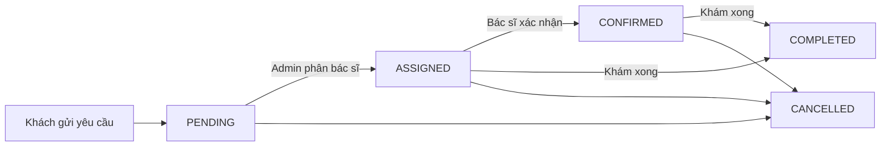
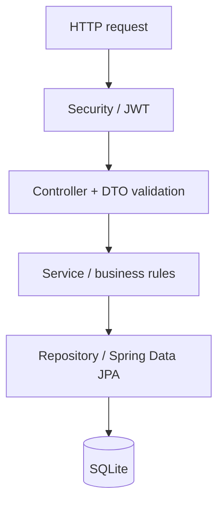

# KTPM-BTL — Dental Clinic Backend

Backend cơ bản cho hệ thống đặt lịch phòng khám nha khoa, xây dựng bằng **Java 17+, Spring Boot 3.5.16, Spring Data JPA, Spring Security JWT và SQLite**. Dự án chia rõ tầng controller, service, repository; có kiểm tra dữ liệu, phân quyền và kiểm thử tích hợp trên SQLite thật.

## Nghiệp vụ

| Người dùng | Chức năng |
| --- | --- |
| Khách hàng | Không cần tài khoản; xem phòng khám, bác sĩ, dịch vụ; gửi yêu cầu đặt lịch; tra cứu hoặc hủy lịch bằng mã đặt lịch. |
| Admin | Đăng nhập; quản lý lịch hẹn; phân công hoặc đổi bác sĩ; quản lý và vô hiệu hóa tài khoản bác sĩ. |
| Bác sĩ | Đăng nhập; xem và cập nhật thông tin cá nhân; chỉ xem, xác nhận, hoàn thành hoặc hủy lịch được phân công cho mình. |

**Khách hàng không chọn bác sĩ khi đặt lịch.** Khách chọn dịch vụ và ngày/giờ mong muốn; Admin quyết định bác sĩ, ngày và giờ khám thực tế. API xem lịch trống vẫn được giữ để tham khảo, không giữ chỗ và không bảo đảm yêu cầu sẽ được phân công vào giờ đó.



- Lịch mới luôn có trạng thái `PENDING`, chưa có bác sĩ.
- Chỉ endpoint phân công của Admin được chuyển lịch sang `ASSIGNED`. Phân công lại lịch `ASSIGNED`/`CONFIRMED` sẽ đưa lịch về `ASSIGNED` để bác sĩ xác nhận lại.
- `COMPLETED` và `CANCELLED` là trạng thái kết thúc, không mở lại hoặc phân công lại.
- Ngày/giờ đặt lịch và phân công phải ở tương lai theo múi giờ `Asia/Ho_Chi_Minh`.
- Giờ bắt đầu theo bước 30 phút, không có giây; toàn bộ ca khám phải nằm trong giờ mở cửa (dữ liệu mẫu: 08:00–17:00 mỗi ngày).
- Thời lượng lấy từ dịch vụ. Hai ca liền kề được phép; hai ca chồng thời gian của cùng bác sĩ bị từ chối. Service kiểm tra trùng lịch và SQLite trigger bảo vệ ở tầng database.
- Hủy lịch khách hàng bằng mã chỉ được thực hiện trước giờ bắt đầu. Admin/bác sĩ có thể đánh dấu hủy theo luồng trạng thái để xử lý nghiệp vụ.
- Không vô hiệu hóa bác sĩ còn lịch `ASSIGNED`/`CONFIRMED`; cần chuyển lịch cho bác sĩ khác hoặc hủy trước.

## Chạy nhanh

Yêu cầu **JDK 17 trở lên**, có `JAVA_HOME` hoặc `java` trong `PATH`. Maven Wrapper đã được đưa vào repository; lần chạy đầu cần Internet để tải Maven và các dependency.

```bash
git clone https://github.com/FlowBoat123/KTPM-BTL.git
cd KTPM-BTL
```

Windows PowerShell:

```powershell
.\mvnw.cmd spring-boot:run
```

Linux/macOS:

```bash
chmod +x mvnw
./mvnw spring-boot:run
```

API chạy tại **http://localhost:8080**. Mặc định chỉ lắng nghe `127.0.0.1`. SQLite tự tạo file `dental-clinic.db` trong thư mục làm việc, không cần cài database server. Dữ liệu lưu lại khi tắt và mở ứng dụng.

Profile mặc định `demo` tạo dữ liệu mẫu khi chưa có: thông tin phòng khám, 3 dịch vụ và các tài khoản sau.

| Username | Password | Vai trò |
| --- | --- | --- |
| `admin` | `Admin123!` | ADMIN |
| `doctor1` | `Doctor123!` | DOCTOR |
| `doctor2` | `Doctor123!` | DOCTOR |

Các thông tin phòng khám, bác sĩ và giá dịch vụ đều là dữ liệu minh họa. Mật khẩu lưu bằng BCrypt; các tài khoản trên chỉ dùng để chạy thử.

## Thử luồng chính

Mở [docs/api.http](docs/api.http) bằng REST Client của VS Code hoặc HTTP Client của IntelliJ. Chọn ngày tương lai rồi chạy theo thứ tự: đặt lịch → đăng nhập Admin → phân bác sĩ → đăng nhập bác sĩ → xác nhận → hoàn thành. Sao chép `id`, `code`, `accessToken` từ response vào các biến tương ứng trong file.

Ví dụ tạo lịch:

```http
POST /api/appointments
Content-Type: application/json

{
  "patientName": "Nguyen Van A",
  "phone": "0912345678",
  "email": "patient@example.com",
  "serviceId": 2,
  "preferredDate": "2030-01-02",
  "preferredTime": "09:00",
  "note": "Kham rang"
}
```

`2030-01-02` là ngày minh họa; thay bằng ngày tương lai. Email và ghi chú là tùy chọn. Response tạo lịch có HTTP `201`, `id`, mã UUID `code`, trạng thái `PENDING` và thông tin đặt lịch. Giữ riêng mã đặt lịch vì người có mã có thể tra cứu và hủy lịch trước giờ khám.

Đăng nhập:

```http
POST /api/auth/login
Content-Type: application/json

{"username":"admin","password":"Admin123!"}
```

Response chứa `accessToken`, `tokenType`, `expiresAt`, `user`. Gửi token với header `Authorization: Bearer <accessToken>` cho các API quản lý.

Phân công:

```http
PATCH /api/admin/appointments/1/assign
Authorization: Bearer <admin-token>
Content-Type: application/json

{"doctorId":1,"appointmentDate":"2030-01-02","startTime":"09:00"}
```

Với dịch vụ mẫu số 2, thời lượng 60 phút, lịch trên kết thúc lúc 10:00. Đổi `1` theo ID thực tế trong response. Bác sĩ hoàn thành bằng `PATCH /api/doctor/appointments/{id}/status` với body `{"status":"COMPLETED"}`.

## Danh sách API

### Công khai

| Method | Endpoint | Chức năng |
| --- | --- | --- |
| GET | `/api/clinic` | Thông tin phòng khám. |
| GET | `/api/services` | Dịch vụ đang hoạt động. |
| GET | `/api/doctors` | Bác sĩ đang hoạt động. |
| GET | `/api/doctors/{id}` | Chi tiết bác sĩ đang hoạt động. |
| GET | `/api/doctors/{id}/available-slots?date=2030-01-02&serviceId=2` | Lịch trống theo ngày và thời lượng dịch vụ; bỏ `serviceId` thì mặc định 30 phút. |
| POST | `/api/appointments` | Tạo yêu cầu đặt lịch. |
| GET | `/api/appointments/{code}` | Tra cứu bằng mã đặt lịch. |
| DELETE | `/api/appointments/{code}` | Hủy lịch; trả về lịch với trạng thái `CANCELLED`. |

### Xác thực

| Method | Endpoint | Chức năng |
| --- | --- | --- |
| POST | `/api/auth/login` | Đăng nhập Admin hoặc bác sĩ. |
| POST | `/api/auth/logout` | Thu hồi token hiện tại; HTTP `204`. |
| GET | `/api/auth/me` | Thông tin tài khoản hiện tại. |

JWT có thời hạn mặc định 120 phút. Mỗi JWT gắn với một phiên trong SQLite, nên đăng xuất thu hồi ngay token hiện tại; vô hiệu hóa tài khoản cũng chặn token đã cấp.

### Bác sĩ — quyền DOCTOR

| Method | Endpoint | Chức năng |
| --- | --- | --- |
| GET | `/api/doctor/appointments` | Các lịch được giao. |
| GET | `/api/doctor/appointments/{id}` | Chi tiết lịch được giao. |
| PATCH | `/api/doctor/appointments/{id}/status` | Body: `{"status":"CONFIRMED"}`, `COMPLETED` hoặc `CANCELLED`, theo luồng hợp lệ. |
| GET | `/api/doctor/profile` | Hồ sơ cá nhân. |
| PUT | `/api/doctor/profile` | Cập nhật hồ sơ cá nhân. |

### Admin — quyền ADMIN

| Method | Endpoint | Chức năng |
| --- | --- | --- |
| GET | `/api/admin/appointments` | Tất cả lịch hẹn. |
| GET | `/api/admin/appointments/{id}` | Chi tiết lịch hẹn. |
| PATCH | `/api/admin/appointments/{id}/assign` | Phân công hoặc đổi bác sĩ/ngày/giờ. |
| PATCH | `/api/admin/appointments/{id}/status` | Thay đổi trạng thái theo luồng hợp lệ. |
| GET | `/api/admin/doctors` | Tất cả bác sĩ, kể cả đã vô hiệu hóa. |
| POST | `/api/admin/doctors` | Tạo tài khoản và hồ sơ bác sĩ. |
| GET | `/api/admin/doctors/{id}` | Chi tiết bác sĩ. |
| PUT | `/api/admin/doctors/{id}` | Cập nhật hồ sơ bác sĩ. |
| DELETE | `/api/admin/doctors/{id}` | Vô hiệu hóa tài khoản; giữ hồ sơ/lịch sử; HTTP `204`. |
| GET | `/api/admin/doctors/{id}/appointments` | Lịch hẹn của bác sĩ. |

Body tạo bác sĩ:

```json
{
  "username": "doctor3",
  "password": "Doctor123!",
  "fullName": "Bac si Le Chi",
  "specialization": "Nha khoa tong quat",
  "phone": "0900000003",
  "email": "doctor3@example.com",
  "description": "Bac si moi"
}
```

Body cập nhật hồ sơ dùng các trường `fullName`, `specialization`, `phone`, `email`, `description`, không có `username`/`password`. PUT thay thế các trường hồ sơ này. Username phải duy nhất; mật khẩu tạo bác sĩ ít nhất 8 ký tự và tối đa 72 byte UTF-8.

### Lỗi API

| HTTP | Ý nghĩa |
| --- | --- |
| 400 | Thiếu trường, sai định dạng, thời gian không hợp lệ hoặc JSON chứa trường ngoài DTO. |
| 401 | Chưa đăng nhập; sai mật khẩu; token sai, hết hạn hoặc đã thu hồi. |
| 403 | Sai vai trò hoặc bác sĩ truy cập lịch của người khác. |
| 404 | Không tìm thấy lịch hẹn, bác sĩ hoặc dịch vụ. |
| 409 | Trùng lịch, trùng username, chuyển trạng thái sai hoặc vô hiệu hóa bác sĩ còn lịch đang mở. |

Response lỗi có `timestamp`, `status`, `message`, `errors`; `errors` chứa lỗi theo trường khi validation thất bại.

## Cấu trúc mã nguồn

```text
src/main/java/com/dental/
├── DentalApplication.java
├── controller/  # Public, Auth, Doctor, Admin: nhận HTTP và gọi service
├── service/     # Appointment, Schedule, Doctor, Catalog, Auth: nghiệp vụ
├── repository/  # Spring Data JPA: truy vấn dữ liệu
├── entity/      # Entity, enum, converter ngày/giờ cho SQLite
├── dto/         # Request, response và mapper; không trả entity/password ra API
├── security/    # JWT, principal và authentication filter
├── config/      # Security, Clock, dữ liệu khởi tạo
└── exception/   # Lỗi nghiệp vụ và response lỗi thống nhất
src/main/resources/
├── application.yml
└── schema.sql   # Bảng, khóa ngoại, index, trigger chống trùng lịch
src/test/java/com/dental/ApiIntegrationTest.java
docs/api.http
.github/workflows/ci.yml
```



Các bảng chính: `accounts`, `doctors`, `clinics`, `dental_services`, `appointments`, `login_sessions`. Account có role `ADMIN`/`DOCTOR`; Doctor liên kết một Account; Appointment liên kết Service và bác sĩ sau khi phân công. Ngày/giờ lưu dạng TEXT ISO để so sánh khung giờ nhất quán. Database bật khóa ngoại và có trigger ngăn chồng lịch. Pool SQLite dùng một kết nối cho backend demo.

## Cấu hình

| Biến môi trường | Mặc định | Công dụng |
| --- | --- | --- |
| `PORT` | `8080` | Cổng HTTP. |
| `SERVER_ADDRESS` | `127.0.0.1` | Địa chỉ lắng nghe. |
| `DB_PATH` | `dental-clinic.db` | File SQLite; thư mục cha phải tồn tại. |
| `JWT_SECRET` | Sinh ngẫu nhiên khi khởi động | Khóa HMAC ít nhất 32 byte UTF-8; đặt giá trị cố định để JWT còn hiệu lực sau khi khởi động lại. |
| `SPRING_PROFILES_ACTIVE` | `demo` nếu không đặt | `demo` tạo tài khoản mẫu; chọn `local` để không tạo các tài khoản mẫu. |
| `ADMIN_USERNAME` | Rỗng | Username Admin khởi tạo ngoài profile demo. |
| `ADMIN_PASSWORD` | Rỗng | Mật khẩu Admin khởi tạo ngoài profile demo, ít nhất 8 ký tự. |

Ví dụ PowerShell chạy với database mới và tài khoản tự đặt:

```powershell
$env:SPRING_PROFILES_ACTIVE = "local"
$env:DB_PATH = "clinic-local.db"
$env:JWT_SECRET = "<thay-bang-khoa-ngau-nhien-it-nhat-32-byte>"
$env:ADMIN_USERNAME = "clinic-admin"
$env:ADMIN_PASSWORD = "<mat-khau-tu-dat>"
.\mvnw.cmd spring-boot:run
```

Bootstrap chỉ tạo tài khoản chưa tồn tại, không đổi mật khẩu tài khoản đã có. Khi chuyển khỏi demo, dùng file DB mới nếu muốn bỏ các tài khoản mẫu đã lưu. `schema.sql` tạo bảng nếu chưa có; đây chưa phải hệ thống migration cho những thay đổi schema sau này.

## Kiểm thử và đóng gói

Windows:

```powershell
.\mvnw.cmd verify
java -jar .\target\dental-clinic-0.0.1-SNAPSHOT.jar
```

Linux/macOS:

```bash
./mvnw verify
java -jar target/dental-clinic-0.0.1-SNAPSHOT.jar
```

Kiểm thử tích hợp dùng file SQLite tạm riêng, thời gian cố định; không sửa database chạy thử. Các ca kiểm tra bao gồm đặt lịch, phân công, chuyển trạng thái, quyền sở hữu lịch, trùng giờ/thời lượng, hủy lịch, quản lý bác sĩ, JWT, đăng xuất, khóa ngoại và trigger database. GitHub Actions chạy `verify` trên JDK 17.

## Phạm vi phiên bản cơ bản

Hiện có 26 endpoint theo tài liệu, SQLite lưu bền, dữ liệu mẫu, JWT và các ràng buộc chính. Chưa có frontend, gửi email/SMS, phân trang, quản lý ngày nghỉ/lịch làm việc riêng từng bác sĩ, API quản lý phòng khám/dịch vụ, đổi mật khẩu hay khôi phục tài khoản. Thông tin phòng khám/dịch vụ mẫu được khởi tạo trong `DataInitializer`.

## Tài liệu nguồn

- [Mô tả bài toán và endpoint trên Google Docs](https://docs.google.com/document/d/1ccs7ITYj_TdFpNJUcTsn6Juie07U2mtpBiy--WwlAJk/edit?tab=t.0).
- [Hội thoại bổ sung nghiệp vụ và kiến trúc](https://chatgpt.com/share/6ac6e733-2410-83ec-8a20-3dbfc287f70b).
- [Spring Boot 3.5 — yêu cầu môi trường](https://docs.spring.io/spring-boot/3.5/system-requirements.html).
- [Xerial SQLite JDBC](https://github.com/xerial/sqlite-jdbc).

SQLite được sử dụng thay MySQL theo yêu cầu hiện tại của dự án.
