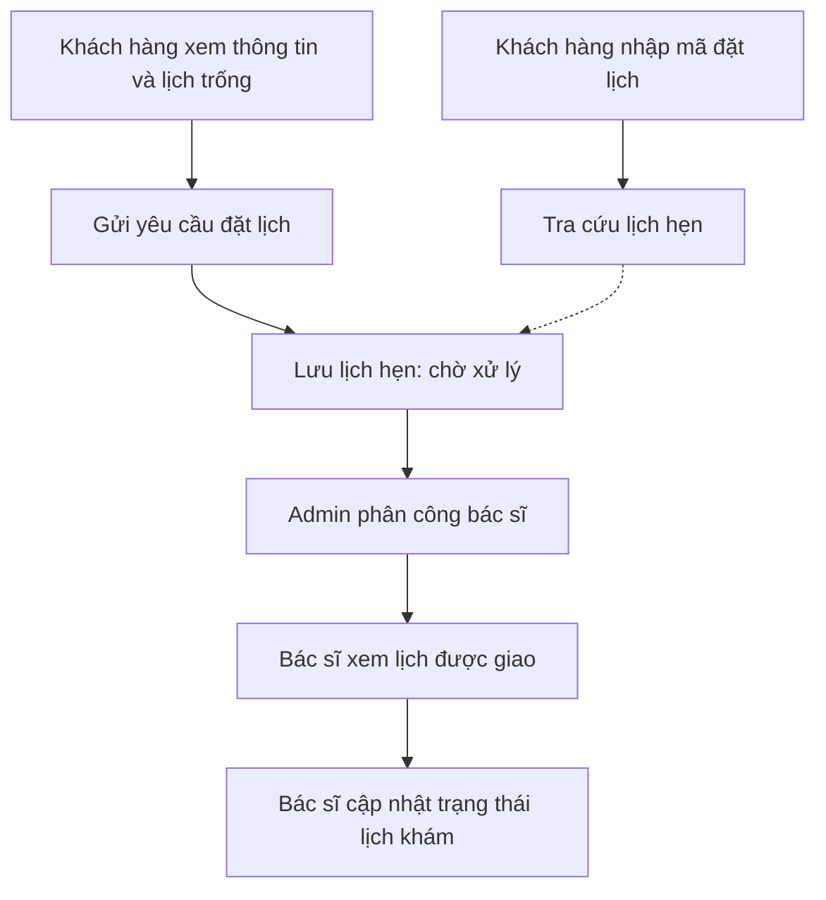
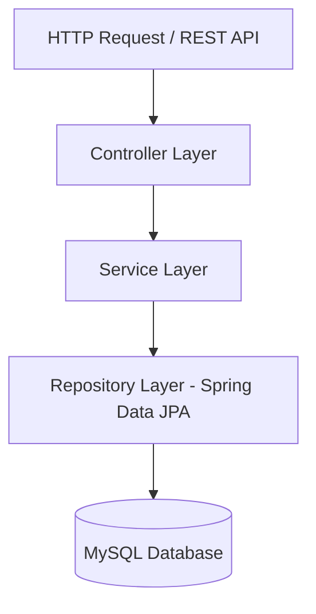

# KTPM-BTL — Dental Clinic Backend

Backend cho **hệ thống đặt lịch phòng khám nha khoa**, hỗ trợ khách hàng gửi yêu cầu đặt lịch trực tuyến, quản trị viên phân công lịch khám và bác sĩ theo dõi các lịch được giao.

> **Trạng thái repository:** hiện chứa tài liệu mô tả dự án; chưa có mã nguồn triển khai. Các chức năng, kiến trúc và endpoint dưới đây được tổng hợp từ tài liệu thiết kế, chưa thể dùng để xác nhận API đã hoạt động.

## Mục tiêu

- Giúp khách hàng tìm hiểu phòng khám, bác sĩ và dịch vụ khám.
- Cho phép khách hàng đặt lịch mà không cần tạo tài khoản hoặc đăng nhập.
- Hỗ trợ Admin tiếp nhận, quản lý và phân công lịch hẹn cho bác sĩ phù hợp.
- Cho phép bác sĩ đăng nhập, xem lịch được phân công và cập nhật trạng thái lịch khám.

## Vai trò và chức năng

| Vai trò | Đăng nhập | Chức năng chính |
| --- | --- | --- |
| Khách hàng / bệnh nhân | Không yêu cầu | Xem thông tin phòng khám, bác sĩ, lịch trống và dịch vụ; gửi yêu cầu đặt lịch; tra cứu lịch hẹn bằng mã đặt lịch. |
| Bác sĩ | Có | Xem các lịch được Admin phân công; xem chi tiết lịch khám; cập nhật trạng thái lịch và thông tin cá nhân. |
| Quản trị viên (Admin) | Có | Quản lý toàn bộ lịch hẹn; phân công bác sĩ; thay đổi trạng thái lịch; tạo tài khoản và quản lý thông tin bác sĩ. |

Chức năng khách hàng tự hủy lịch hẹn là **tùy chọn**, theo phạm vi hỗ trợ của dự án.

## Luồng đặt lịch khám

1. Khách hàng xem thông tin phòng khám, danh sách bác sĩ, dịch vụ và lịch trống.
2. Khách hàng gửi yêu cầu đặt lịch kèm thông tin cá nhân và thời gian mong muốn.
3. Hệ thống lưu lịch hẹn ở trạng thái **chờ xử lý**.
4. Admin xem yêu cầu và phân công lịch cho bác sĩ phù hợp.
5. Bác sĩ đăng nhập để xem lịch được phân công và cập nhật trạng thái lịch khám.
6. Khách hàng có thể tra cứu lịch hẹn bằng mã đặt lịch.



## Kiến trúc hệ thống

Dự án được thiết kế theo **Layered Architecture**:



| Thành phần | Trách nhiệm |
| --- | --- |
| Controller Layer | Tiếp nhận HTTP request và cung cấp REST API. |
| Service Layer | Xử lý nghiệp vụ đặt lịch, phân công bác sĩ và xác thực. |
| Repository Layer | Truy vấn và thao tác dữ liệu bằng Spring Data JPA. |
| MySQL Database | Lưu thông tin bác sĩ, tài khoản, dịch vụ và lịch hẹn. |

### Công nghệ được nêu trong thiết kế

- **REST API:** giao tiếp giữa ứng dụng khách và backend qua HTTP.
- **Spring Data JPA:** truy cập và thao tác dữ liệu ở Repository Layer.
- **MySQL:** lưu trữ dữ liệu của hệ thống.

Tài liệu chưa quy định phiên bản công nghệ, cơ chế xác thực cụ thể hoặc công cụ build.

## Đặc tả REST API

Các đường dẫn dưới đây là đặc tả trong tài liệu. `{doctorId}`, `{id}` và `{code}` là tham số đường dẫn cần thay bằng giá trị tương ứng.

### Khách hàng / bệnh nhân

Khách hàng sử dụng các chức năng này mà không cần tài khoản.

| Method | Endpoint | Chức năng |
| --- | --- | --- |
| GET | `/api/clinic` | Xem thông tin phòng khám. |
| GET | `/api/doctors` | Xem danh sách bác sĩ. |
| GET | `/api/doctors/{doctorId}` | Xem chi tiết bác sĩ. |
| GET | `/api/doctors/{doctorId}/available-slots?date=2026-10-10` | Xem lịch trống của bác sĩ theo ngày. |
| GET | `/api/services` | Xem các dịch vụ khám. |
| POST | `/api/appointments` | Gửi yêu cầu đặt lịch khám. |
| GET | `/api/appointments/{code}` | Tra cứu lịch hẹn bằng mã đặt lịch. |
| DELETE | `/api/appointments/{code}` | Hủy lịch hẹn — chức năng tùy chọn. |

Giá trị `2026-10-10` là ngày minh họa trong tài liệu; thay bằng ngày muốn tra cứu.

### Xác thực

Luồng đăng nhập dành cho bác sĩ và Admin.

| Method | Endpoint | Chức năng |
| --- | --- | --- |
| POST | `/api/auth/login` | Bác sĩ / Admin đăng nhập. |
| POST | `/api/auth/logout` | Đăng xuất. |
| GET | `/api/auth/me` | Lấy thông tin người dùng hiện tại. |

### Bác sĩ

Các chức năng dành cho bác sĩ sau khi đăng nhập.

| Method | Endpoint | Chức năng |
| --- | --- | --- |
| GET | `/api/doctor/appointments` | Xem các lịch được Admin phân công. |
| GET | `/api/doctor/appointments/{id}` | Xem chi tiết lịch khám. |
| PATCH | `/api/doctor/appointments/{id}/status` | Cập nhật trạng thái lịch khám. |
| GET | `/api/doctor/profile` | Xem thông tin cá nhân. |
| PUT | `/api/doctor/profile` | Cập nhật thông tin cá nhân. |

### Quản trị viên (Admin)

Các chức năng dành cho Admin sau khi đăng nhập.

| Method | Endpoint | Chức năng |
| --- | --- | --- |
| GET | `/api/admin/appointments` | Xem tất cả lịch hẹn. |
| GET | `/api/admin/appointments/{id}` | Xem chi tiết lịch hẹn. |
| PATCH | `/api/admin/appointments/{id}/assign` | Phân công lịch hẹn cho bác sĩ. |
| PATCH | `/api/admin/appointments/{id}/status` | Thay đổi trạng thái lịch hẹn. |
| GET | `/api/admin/doctors` | Xem danh sách bác sĩ. |
| POST | `/api/admin/doctors` | Tạo tài khoản bác sĩ. |
| GET | `/api/admin/doctors/{id}` | Xem thông tin bác sĩ. |
| PUT | `/api/admin/doctors/{id}` | Sửa thông tin bác sĩ. |
| DELETE | `/api/admin/doctors/{id}` | Xóa hoặc vô hiệu hóa bác sĩ. |
| GET | `/api/admin/doctors/{id}/appointments` | Xem lịch của một bác sĩ. |

## Lấy repository về máy

```bash
git clone https://github.com/FlowBoat123/KTPM-BTL.git
cd KTPM-BTL
```

Chưa có hướng dẫn khởi chạy ứng dụng vì repository chưa chứa mã nguồn, cấu hình cơ sở dữ liệu hoặc cấu hình build. Khi bổ sung phần triển khai, cần cập nhật:

- Yêu cầu môi trường và phiên bản công nghệ.
- Cách tạo và cấu hình cơ sở dữ liệu MySQL.
- Lệnh build, chạy ứng dụng và kiểm thử.
- Cấu trúc mã nguồn.
- Request / response mẫu, mã lỗi và cơ chế xác thực API.
- Các trạng thái lịch hẹn và quy tắc chuyển trạng thái.

## Tài liệu tham khảo

- [Tài liệu mô tả bài toán, kiến trúc và endpoint](https://docs.google.com/document/d/1ccs7ITYj_TdFpNJUcTsn6Juie07U2mtpBiy--WwlAJk/edit?tab=t.0)
- [Repository KTPM-BTL](https://github.com/FlowBoat123/KTPM-BTL)
